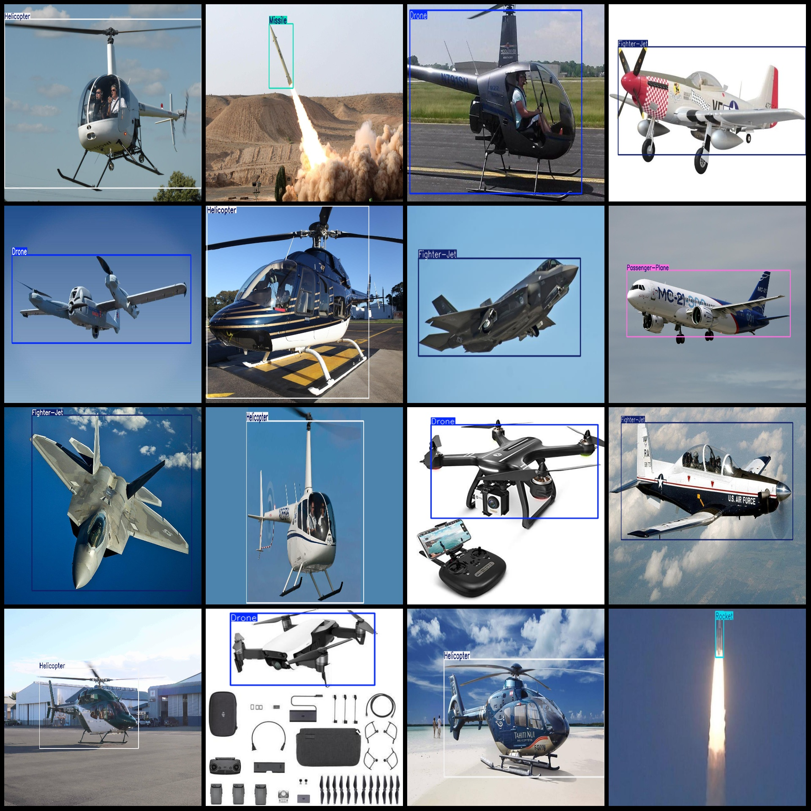

# Six-class object detection dataset with 2029 images in VOC+YOLO format

Dataset format: Pascal VOC format + YOLO format (without split path, only txt files containing jpg images and corresponding VOC format.xml files and yolo format.txt files)
number of images: 2029  
annotation count: 2029  
Annotation count is 2029.
Label the number of categories: 6.
Annotation class names: ["Drone", "Fighter-Jet", "Helicopter", "Missile", "Passenger-Plane", "Rocket"]
Each category labeled boxes:
The number of drones in the box is 558.
Fighter-Jetbox count = 637  
Helicopter box count = 550
Missilebox count = 155  
The passenger-plane box count is 210.
Rocket box count = 204  
total boxes: 2314  
images per class:   
Drone images are typically 512x512 pixels, which means each image has 512 rows and 512 columns. This is a common size for drone images due to the limitations of sensor resolution and computational power.
Fighter-Jetimages = 468  
Helicopter images = 512
Missileimages = 140  
Passenger-Plane images = 196
Rocket images = 202  
Image resolution: Multi-resolution images, such as 810x513, 1024x768, etc.
Using annotation tool: labelImg
Annotation rules: Drawing a rectangle box around the class
Important notes: The dataset does not have a division of training, validation, and test sets; you need to divide it yourself.
Special Notice: This dataset does not guarantee the accuracy of the trained model or any weight files.
Image Preview: 
Annotation Example:
## Images

Here is a pay link on Stripe ( https://buy.stripe.com/3cs8yP7sY87d0vu9AB ). Please contact me lonlonago@foxmail.com after funding $89, and I will send you a complete data files , thank you!

